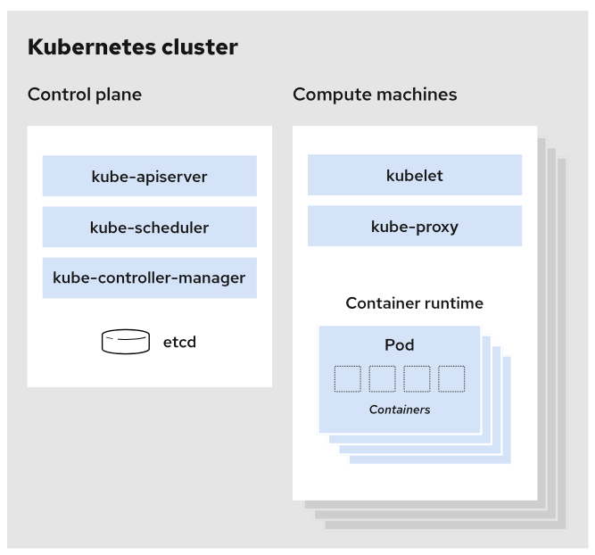

## O que é um cluster?

Uma boa definição para cluster dentro do universo Kubernetes é toda implementação Kubernetes em funcionamento.

Mas vamos aprofundar mais esse conceito entendendo melhor a arquitetura de um cluster:

**O cluster kubernetes é dividido em:** node master e node worker (ou node cluster).

## Node Master

O node master, também conhecido como plano de controle é responsável por definir e manter o estado desejado do worker. Ele é formado por:

**kube-apiserver:** de forma simplificada, essa camada é o frontend do nosso plano de controle. É uma API do Kubernetes capaz de processar solicitações internas e externas

**kube-schedule:** essa é a camada responsável por manter a integridade do ambiente. Ela fica monitorando seu ambiente e levantando ou derrubando containers quando necessário. Ela também nos auxilia no deploy possuindo a capacidade de identificar o melhor worker para receber a atualização.

**kube-control-manager:** essa camada é responsável por gerenciar todos os controladores da nossa aplicação Kubernetes. Quando falamos em controladores dentro do kubernetes estamos falando de um loop de controle que observa por meio da api server as informações compartilhadas de um cluster e faz alterações na tentativa de movê-lo do estado atual para o estado desejado.

etcd: é um banco de dados distribuído que armazena configurações de estado do cluster no padrão chave-valor.

## Node Worker

Já o node worker é onde as instâncias da nossa aplicação serão executadas. Ele é formado por:

**pod:** representa a menor unidade dentro do modelo de objetos do Kubernetes. É uma instância da aplicação

**kubelet:** para cada node de um cluster existe um agente responsável por garantir que os containers estejam sendo executados dentro de um pod. Esse é o kubelet.

**kube-proxy:** é ele quem mantém a regra de rede entre os nós do seu cluster implementando a parte de conceito de serviços do Kubernetes. O kube-proxy tenta utilizar a camada de rede do sistema operacional servidor e, caso não consiga, encaminha o tráfego por si próprio.

**container runtime:** é a engine de execução dos nossos containers, bons exemplos são os nossos já conhecidos Docker ou o Podman.

Agora que vimos todas as partes que compõem a arquitetura de um cluster, vamos montar esse quebra-cabeças dando uma olhada nesse diagrama:

Chamamos de cluster cada implantação do kubernetes que é dividida em plano de controle e node cluster (no gráfico, compute machine). Cada node possui Pods que são formados por containers.

A partir desse ponto do nosso curso nós vamos abordar mais cada um destes conceitos. Nosso objetivo aqui é entender o que é um cluster Kubernetes e como ele funciona. Na próxima aula vamos subir nosso primeiro cluster kubernetes.
