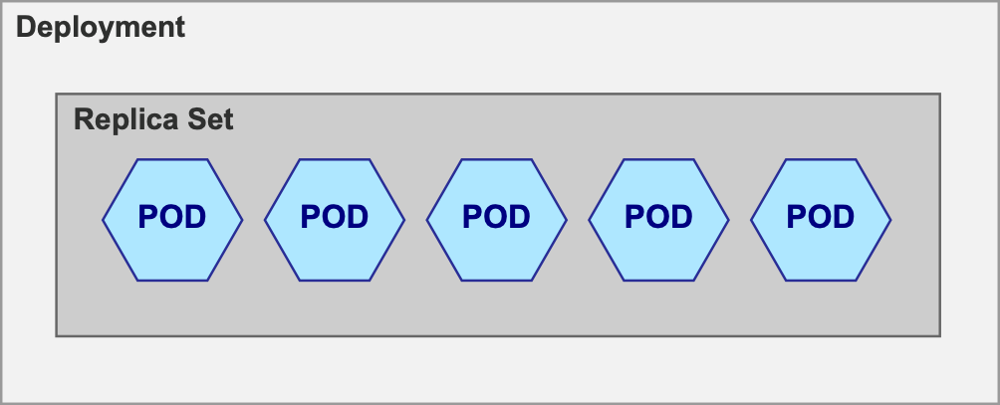

## Entendendo Deployments

Vamos entender o conceito de deployment dentro do kubernetes.

Chamamos de deployments os objetos do Kubernetes que gerenciam o deploy dos Pods. É aqui que definimos como criar e atualizar instâncias do nosso aplicativo, sendo possível, por exemplo, definir as imagens de containers a serem usadas, as portas disponibilizadas pelos containers, nome do pod, entre outras configurações.

Depois de criado um deployment, fica a encargo do master node do Kubernetes agendar as instâncias do aplicativo declaradas no deployment para que sejam executadas em nós individuais do cluster.

Vamos aprofundar um pouco esse conceito pincelando antes mais um termo: Replica Sets.

Lembra de que no início do nosso curso falamos que o Kubernetes nos permite escalar horizontalmente? Pois é, isso acontece justamente replicando-se os Pods. Quem faz isso para nós é o Replica Set. O replica set é uma estrutura criada acima dos pods e é responsável por nos fornecer o ferramental necessário para escalar determinado pod.

Já o deployment é uma camada que está acima do replica set. Sempre que criamos um deployment nós acabamos criando também um replica set bem como a quantidade de Pods declaradas no arquivo yaml.

O replica set é quem vai te oferecer o recurso de escalabilidade horizontal e o deployment é uma camada que vai ser criada acima e automaticamente vai gerar um replica set. Mas então por que devo usar um deployment e não declaro o replica set direto?

Além de oferecer uma estrutura de escalabilidade horizontal por encapsular um replica set, um deployment também vai te oferecer um dos recursos mais interessantes dentro da estrutura do Kubernetes: a automação de deploys.

Sempre que uma nova funcionalidade for lançada no seu ambiente, o deployment vai gerar novos Pods com essa instância atualizada e de forma controlada vai remover as instâncias desatualizadas e apontar os demais recursos para as novas instâncias até que todo seu ambiente esteja atualizado. Isso faz com que sua aplicação seja atualizada sem a necessidade de tirá-la completamente do ar.

Na próxima aula vamos criar nosso primeiro deployment e ver esses conceitos funcionando na prática.
