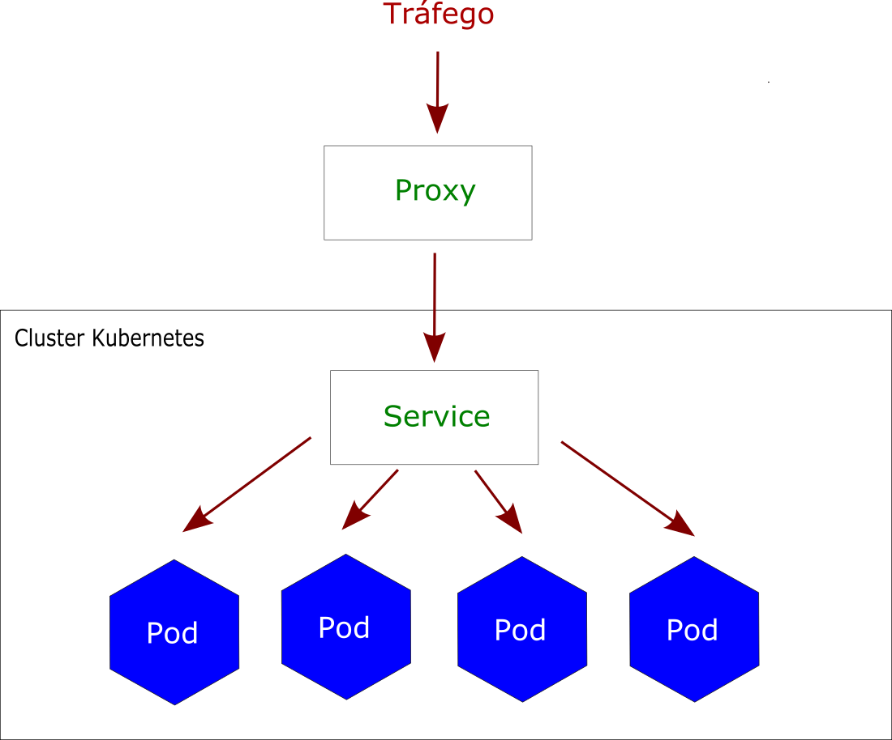
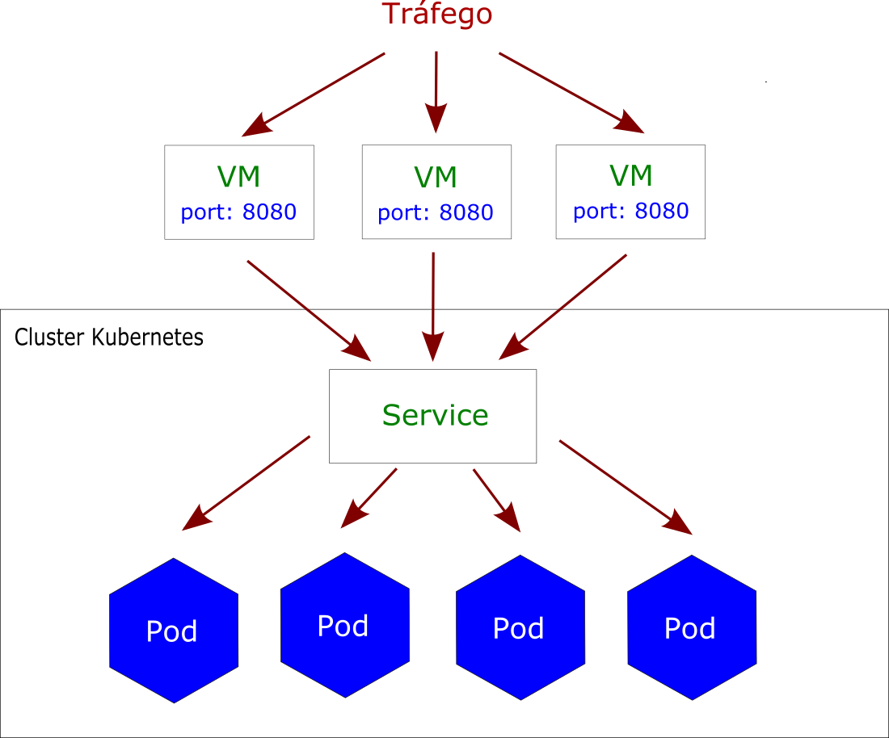
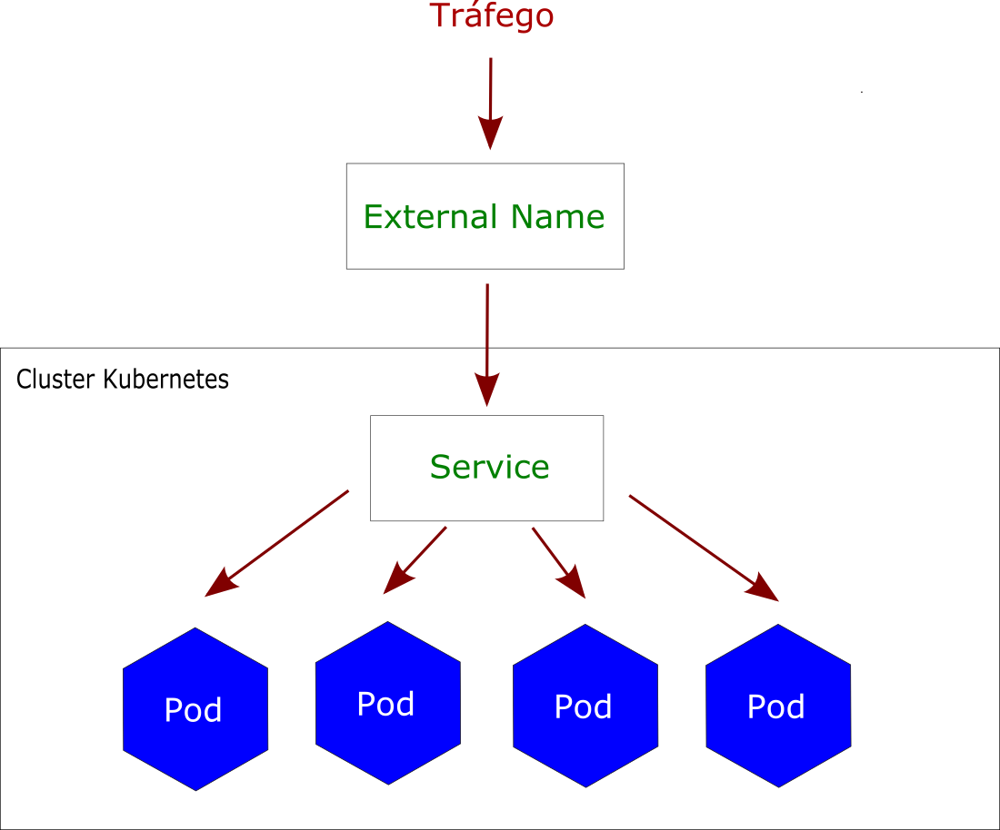

## O que é um Service?

Nós aprendemos em aulas anteriores que um Pod é a menor estrutura dentro do kubernetes. Vimos também que um pod tem início e fim. Sempre que um processo é encerrado por qualquer razão o pod é perdido e então uma nova instância dele é iniciada com outro IP. Quem nos garante isso é um outro componente do kubernetes chamado Replica Set.

É importante levantar aqui que um pod não é acessado diretamente por um endereço público. Dentre algumas razões, podemos salientar a inviabilidade pela própria troca de IPs a cada re-criação de um pod. Então como podemos expor uma aplicação utilizando o kubernetes? É aqui que entra o papel de um outro componente dentro da estrutura de kubernetes: o service.

Podemos definir um service como uma camada de abstração que define um conjunto de Pods e sua política de acesso e permite um baixo acoplamento entre os Pods dependentes.

Em outras palavras, mesmo que um pod possua um IP próprio ele não é exposto externamente ao cluster sem o auxílio de um service. É ele quem possibilita o tráfego roteando-o entre um conjunto de Pods. Ele é a abstração que permite que um pod "morra" ou se repliquem através do replica set.

O service relaciona um conjunto de Pods utilizando rótulos e seletores, um agrupamento que permite operações lógicas entre objetos do kubernetes.

Um service pode ser exposto de diversas maneiras:

## ClusterIP

Essa é a forma padrão, o service expõe o serviço sob endereço IP interno dentro do cluster. Dessa forma o serviço é acessível apenas dentro do cluster.

## NodePort

Expõe o serviço em cada IP do pod em porta estática utilizando NAT. Essa forma torna o serviço acessível externamente ao cluster utilizando <NodeIP>:<NodePort>.

## LoadBalancer

Cria um balanceador de carga externo no provedor e configura um IP fixo externo para o serviço.

## ExternalName

Mapeia o serviço para um name especificado na configuração do service, (ex: exemplo.k8s.com) e retorna um registro CNAME com seu valor. Não utiliza qualquer proxy e requer uma versão 1.7 ou superior do kube-dns.

Agora que entendemos o conceito geral de Services, nas próximas aulas iremos implementar um service dentro da nossa estrutura.
