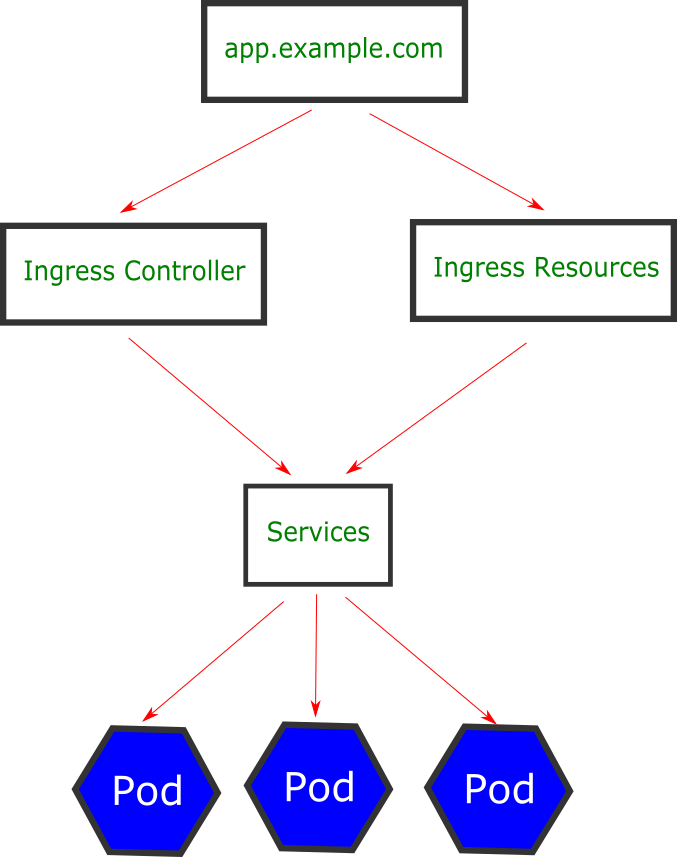

## Entendendo o Ingress

Agora que entendemos os componentes core do kubernetes vamos falar sobre um último componente. O Ingress é responsável por expor uma aplicação servida pelo kubernetes publicamente. Para isso, ele externaliza o service de um cluster trabalhando com protocolos como HTTP, HTTPS, SSL/TSL, com balanceamento de carga, websockets, roteamento de trafego, entre outros.

O Ingress é composto por dois componentes: O Ingress Resource e o Ingress Controller.

Quando falamos em Ingress Resource estamos falando no componente responsável por definir as diretrizes que nos dizem como queremos externalizar um service.

Já o Resource Controller é o interpretador do Ingress Resource.

Podemos dizer que o Ingress abstrai um ou mais Services assim como o Services o faz com os Pods. Quando uma solicitação é enviada para o nosso cluster o primeiro a recebê-la é o nosso Ingress controller.

O Ingress controller, por sua vez, vai analisar todas as regras existentes para a requisição dentro do Ingress Resource e somente então enviar para o service que deve então direcionar ao onde temos o pod com nossa aplicação, assim como na figura abaixo.

Dessa forma podemos criar diversos Ingress apontando para diferentes Services expondo nossa aplicação em outros endpoints.

Agora que entendemos o conceito de Ingress vamos aplicá-lo na prática na próxima aula.
